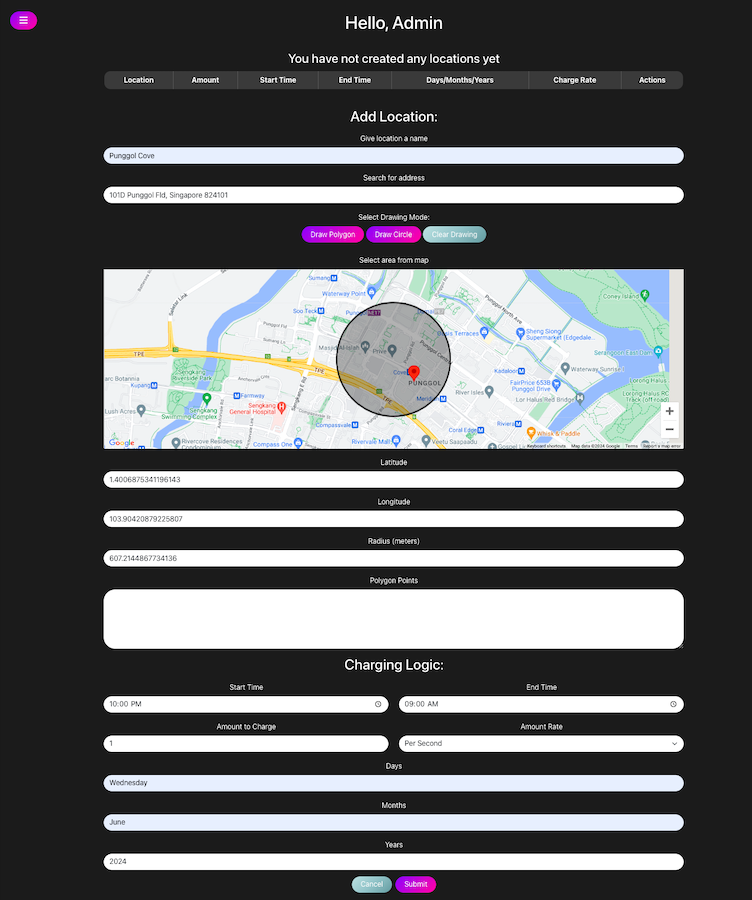

# Virtual RFID and Geofencing System

This project uses mobile phone's GPS as virtual RFID devices and Google Maps API for geofencing. It includes an admin panel for setting up charging rules and a user app for managing accounts and viewing transactions.

## Features

### Admin Panel (Web App)
- **Built with**: ReactJS
- **Capabilities**:
  - Set country and location ranges using Google Maps API.
  - Name locations and link them with Google Maps locations.
  - Define time ranges.
  - Set charge amounts for each location.
  - Choose charge rate (per second, minute, or hour).
  - Specify when rules apply (days, months, years).
- **Views**:
  - Manage saved locations and their charging rules.
  - View transaction history.

### User App (Web App)
- **Built with**: ReactJS
- **Capabilities**:
  - Signup/Login.
  - Detect phone type (iOS/Android) and enable GPS.
  - Integrate with Google geofencing/tracking API to detect entry into geofences and apply charges.
  - View current balance.
  - Top up balance using Stripe integration.
  - View transaction history (timestamp, location name, location, amount).
  - Edit profile (email, password).
  

### Geofencing and Charging System
- **Built with**: Python Django
- **Capabilities**: Uses Google Maps API for geofencing and automatically charges users entering designated location ranges based on admin rules.

### Database
- **Options**: SQLite
- **Stores**:
  - User information
  - Location details
  - Transaction history
  - Charging logic

## Workflow
1. Admin sets charging rules.
2. User signs up/logs in and enables GPS.
3. User's device detects entry into a geofence.
4. Geofencing system sends a charge request to the backend.
5. Backend verifies location, checks balance, and deducts the amount.
6. User app updates balance and shows deduction details.

## Technical Requirements
- **Backend Framework**: Python Django
- **Database**: SQLite (for development)

## API Endpoints

- **User Management**:
  - `POST /api/register/` - Register a new user
  - `POST /api/token/` - Obtain auth token
  - `GET /api/users/me/` - Get current user details
  - `PUT /api/profile/update/` - Update user profile

- **Charging Logic**:
  - `GET /api/charging-logics/` - List all charging logics
  - `POST /api/charging-logics/` - Create a new charging logic
  - `PUT /api/charging-logics/<id>/disable/` - Disable a charging logic
  - `PUT /api/charging-logics/<id>/enable/` - Enable a charging logic

- **Location Management**:
  - `GET /api/locations/` - List all locations
  - `POST /api/locations/` - Create a new location

- **Transactions**:
  - `GET /api/transactions/` - List all transactions
  - `POST /api/transactions/create/` - Create a new transaction

- **Balance Management**:
  - `GET /api/balance/` - Get current balance
  - `POST /api/make-payment/` - Make a payment

## Screenshots



## Setup Instructions
1. Clone the repository:
   ```bash
   git clone https://github.com/Amalina-Hashim/virtual_rfid_FE.git
